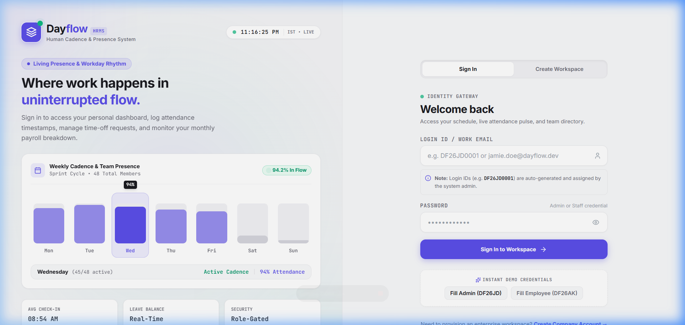
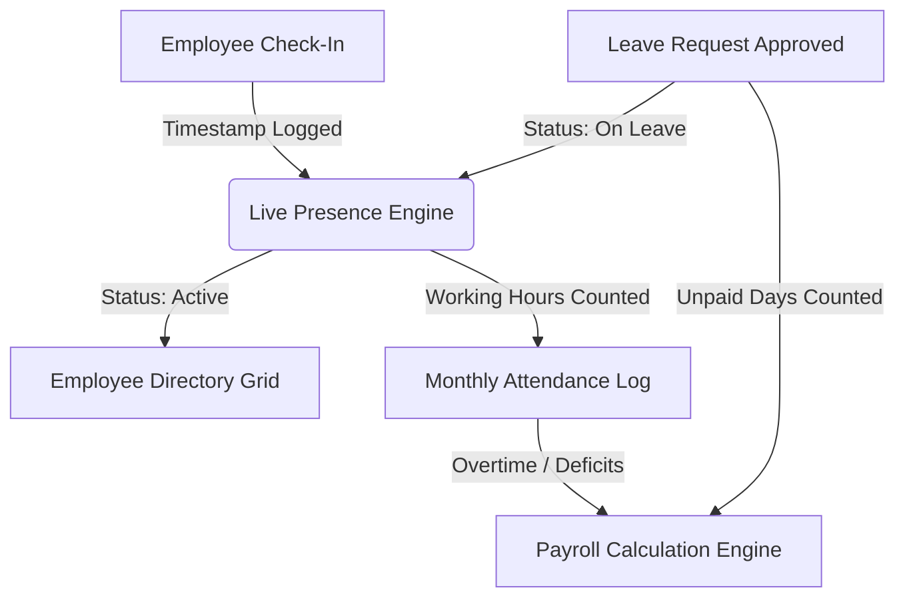
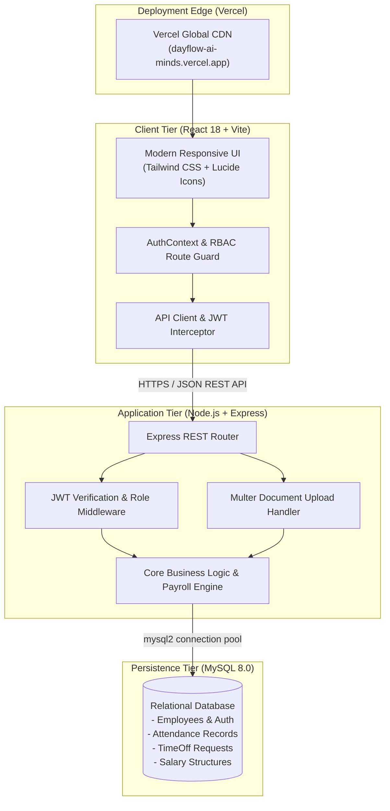
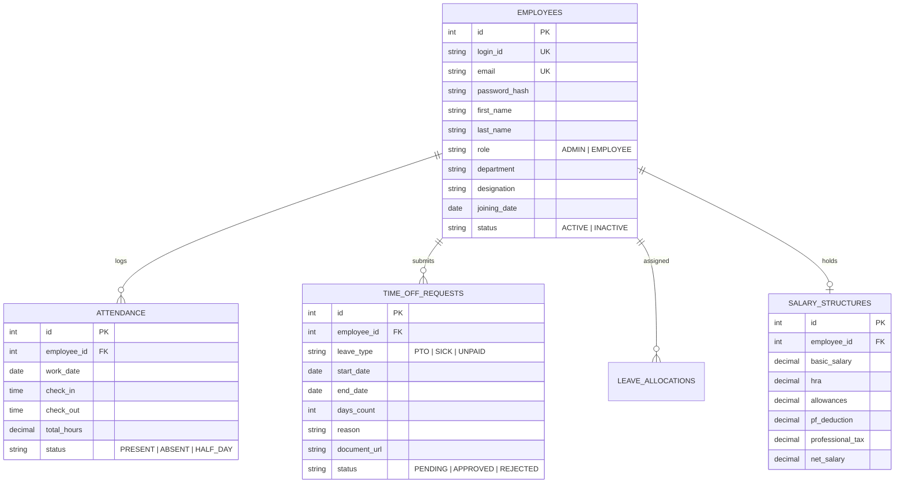

<div align="center">

# ⚡ Dayflow — Human Resource Management System
### *The Next-Generation, Intelligent & Real-Time HRMS Platform*

[](https://dayflow-ai-minds.vercel.app/)
[](https://react.dev/)
[](https://nodejs.org/)
[](https://www.mysql.com/)
[](https://tailwindcss.com/)
[](https://jwt.io/)

<br/>

**Dayflow** is an all-in-one, enterprise-grade Human Resource Management System engineered to streamline workforce operations, automate time-tracking and leave approvals, eliminate payroll bottlenecks, and empower organizations with real-time employee presence intelligence.

[🌐 Experience Live Demo](https://dayflow-ai-minds.vercel.app/) • [🎬 Watch Video Demo](#-video-walkthrough--demo) • [📑 Key Features](#-key-modules--capabilities) • [🏗️ Architecture](#%EF%B8%8F-system-architecture) • [🚀 Quick Start](#-getting-started)

---

</div>

## 🏆 Hackathon Judges' Quick Evaluation

| 🌟 **Resource** | 🔗 **Link / Credentials** | 📝 **Notes** |
| :--- | :--- | :--- |
| **🌐 Production Web App** | [**dayflow-ai-minds.vercel.app**](https://dayflow-ai-minds.vercel.app/) | High-speed global edge deployment on Vercel |
| **👑 Admin / HR Officer Account** | `jamie.doe@dayflow.dev` *(or `DF26JD0001`)* <br/>**Password:** `Password@123` | Full access: Payroll, Employee Approvals, Leave Quota Management, Org Analytics |
| **👤 Standard Employee Account** | `alex.kumar@dayflow.dev` *(or `DF26AK0002`)* <br/>**Password:** `Password@123` | Self-service: Check-in/out, Leave requests with file upload, Salary slips, Profile |
| **📦 GitHub Repository** | [AshvittaS/Dayflow](https://github.com/AshvittaS/Dayflow) | Monorepo architecture (`dayflow-frontend` + `dayflow-backend`) |

---

## 🎬 Video Walkthrough & Demo

> 💡 **Click below to watch the complete 3-minute end-to-end product tour of Dayflow** showcasing admin management, real-time presence indicators, payroll calculations, and self-service employee workflows.

[](https://dayflow-ai-minds.vercel.app/)

<div align="center">
  
  <p><em>Figure 1: Dayflow Intelligent Authentication Interface with Deterministic ID Recognition</em></p>
</div>

---

## 💡 The Problem & Dayflow's Solution

| The Traditional HR Pain Point | ⚡ How Dayflow Solves It |
| :--- | :--- |
| **Fragmented Systems**: Attendance, leave requests, and payroll run on separate disjointed tools. | **Unified Single-Pane Ecosystem**: Real-time sync between attendance logs, leave balances, and salary deductions in one single source of truth. |
| **Manual Payroll Calculation Errors**: HR spends hours manually deducting unpaid leaves and recalculating taxes. | **Dynamic Formula-Driven Payroll Engine**: Automatic calculation of Basic, HRA, Standard/Fixed allowances, PF, PT, and attendance-linked salary adjustments. |
| **Ghost Attendance & Unclear Presence**: Managers have no live visibility into who is working or on leave. | **Real-Time Presence Engine**: Live status tags (🟢 Active / 🟡 Absent / ✈️ On Leave) synced seamlessly across company directory. |
| **Clunky Employee Experience**: Complex paperwork for sick leave and medical certificate attachments. | **Modern Self-Service Portal**: 1-click check-in/out, interactive leave calendar, and instant medical certificate file uploads. |

---

## 🚀 Key Modules & Capabilities

### 1. 🔐 Role-Based Access Control (RBAC) & Visual Auth
* **Dual-Tier Permission Architecture**: Strict isolation between **Admin / HR Managers** and **Employees** enforced at both the React route layer and Express backend middleware.
* **Deterministic Login ID System**: Automatically generates standardized corporate identifiers (`DF26JD0001`) based on Company Code, Initials, Joining Year, and Counter.
* **First-Time Password Security**: First-login detection with mandatory password change and bcrypt salt hashing.

### 2. 👥 Real-Time Employee Directory & Presence Hub
* **Interactive Live Directory**: Searchable, filterable card grid categorized by department (Engineering, Sales, HR, Design, Operations) and employment status.
* **Live Presence Badges**:
  * 🟢 **Active / Checked In**: Real-time timer showing time on the clock today.
  * 🟡 **Absent / Pending Check-In**: Immediate alert for unrecorded attendance.
  * ✈️ **On Approved Leave**: Syncs dynamically with the Time-Off approval subsystem.
* **Profile & Privacy Sandbox**: Granular data privacy protecting sensitive contact and compensation information from peer views.



### 3. ⏱️ Precision Attendance Tracking & Logs
* **One-Click Check-In / Check-Out**: Single-action timestamp logging with duplicate prevention.
* **Detailed Monthly Matrix**: Daily logs of check-in time, check-out time, total working hours, overtime hours, and attendance remarks.
* **Admin Organization Overview**: Cross-employee daily attendance audit board with date filtering and export capability.

### 4. 🌴 Intelligent Leave & Time-Off Management
* **Leave Categories**: Paid Time Off (PTO), Sick Leave (with medical certificate document upload via `multer`), and Unpaid Leave.
* **Interactive Calendar Matrix**: Color-coded month-grid showcasing personal leave requests, pending reviews, and approved days.
* **HR Approval Queue**: Centralized review interface for Admin/HR with one-click approval, rejection remarks, and quota adjustments.

### 5. 💰 Dynamic Attendance-Linked Payroll Engine (Admin-Only)
* **Configurable Salary Structure**: Supports Monthly & Annual wages, Hourly and Salaried arrangements with custom working days.
* **Automated Earnings Breakdown**:
  * **Basic Salary** (e.g. 40% - 50%)
  * **House Rent Allowance (HRA)**
  * **Standard & Fixed Allowances**
  * **Performance Bonuses & Incentives**
* **Statutory Deductions & Taxes**:
  * **Provident Fund (PF)**: Auto-computed Employee & Employer shares
  * **Professional Tax (PT)**: Regional slab calculation
  * **Unpaid Leave Penalty**: Pro-rata daily wage deductions linked to attendance.

---

## 🏗️ System Architecture



---

## 🗄️ Database Schema Overview



---

## 🛠️ Technology Stack

| Layer | Technology | Key Capabilities & Highlights |
| :--- | :--- | :--- |
| **Frontend** | **React 18 + Vite 5** | Lightning-fast HMR, component modularity, fluid client-side routing with `react-router-dom v6` |
| **Styling** | **Tailwind CSS + Lucide Icons** | Custom design tokens, dark/light contrast ergonomics, responsive mobile & desktop viewports |
| **Backend API** | **Node.js + Express** | High-throughput asynchronous REST API architecture with clean controller-route separation |
| **Database** | **MySQL 8.0 + `mysql2/promise`** | ACID-compliant transactional consistency, indexed search, connection pooling |
| **Authentication** | **JWT + Bcrypt** | Stateless cryptographic token auth, 24h expiration, salted password hashing |
| **File Storage** | **Multer** | Multipart form processing for medical certificate attachments & documents |
| **Deployment** | **Vercel** | Edge network deployment with automated CI/CD and optimized build artifacts |

---

## 🔌 API Reference Overview

| Module | Method | Endpoint | Description | Auth Level |
| :--- | :--- | :--- | :--- | :--- |
| **Auth** | `POST` | `/api/auth/login` | Authenticate user with Email/Login ID & Password | Public |
| **Auth** | `POST` | `/api/auth/change-password` | Update system-generated temporary password | Authenticated |
| **Employees** | `GET` | `/api/employees` | Fetch list of employees with live presence status | Authenticated |
| **Employees** | `POST` | `/api/employees` | Create a new employee with auto-generated ID | **Admin Only** |
| **Employees** | `PUT` | `/api/employees/:id` | Update employee profile & permissions | **Admin Only** |
| **Attendance** | `POST` | `/api/attendance/check-in` | Record today's check-in timestamp | Authenticated |
| **Attendance** | `POST` | `/api/attendance/check-out` | Record today's check-out timestamp & compute hours | Authenticated |
| **Attendance** | `GET` | `/api/attendance/my-logs` | Retrieve authenticated employee's monthly logs | Authenticated |
| **Time Off** | `POST` | `/api/timeoff/request` | Submit leave request with optional certificate | Authenticated |
| **Time Off** | `PATCH` | `/api/timeoff/:id/status` | Approve or reject a leave request | **Admin Only** |
| **Payroll** | `GET` | `/api/salary/my-slip` | Retrieve employee's latest itemized payslip | Authenticated |
| **Payroll** | `PUT` | `/api/salary/:employeeId` | Update employee wage configuration & allowances | **Admin Only** |

---

## 💻 Getting Started

### Prerequisites
* **Node.js** (v18.0.0 or higher)
* **npm** (v9.0.0 or higher)
* **MySQL Server** (v8.0+) or a cloud MySQL URI (PlanetScale / Aiven / Railway)

### 1. Clone the Repository
```bash
git clone https://github.com/AshvittaS/Dayflow.git
cd Dayflow
```

### 2. Backend Setup & Run
```bash
cd dayflow-backend
npm install

# Configure Environment Variables:
# Create a .env file with your database credentials:
# PORT=4000
# DB_HOST=localhost
# DB_USER=root
# DB_PASSWORD=your_password
# DB_NAME=dayflow_db
# JWT_SECRET=your_jwt_secret_key

# Run database schema migration & seed demo data:
npm run schema
npm run seed

# Start development API server:
npm run dev
# Server running at: http://localhost:4000
```

### 3. Frontend Setup & Run
```bash
# Open a new terminal window:
cd dayflow-frontend
npm install

# Start Vite development server:
npm run dev
# Application running at: http://localhost:5173
```

---

## 🔐 Demo Credentials for Testing

| Role | Username / Login ID | Password | Access Capabilities |
| :--- | :--- | :--- | :--- |
| 🛡️ **Admin / HR** | `jamie.doe@dayflow.dev` *(or `DF26JD0001`)* | `Password@123` | Full org directory, Leave review, Salary structuring, Analytics |
| 👨‍💼 **Employee** | `alex.kumar@dayflow.dev` *(or `DF26AK0002`)* | `Password@123` | Self-service check-in, Personal time-off, Payslip viewer, Profile |

---

## 🗺️ Roadmap & Future Enhancements

- [ ] **AI-Powered Workday Summaries**: Automated daily productivity summaries using Gemini LLM.
- [ ] **Facial / Geofencing Check-In**: Mobile GPS geofencing and facial verification for anti-spoof attendance.
- [ ] **Automated Tax Filing (Form-16)**: PDF generation of fiscal year tax deduction reports.
- [ ] **Slack / Teams Bot Integrations**: Approve time-off requests directly from team chat channels.

---

## 👥 Authors & Acknowledgements

* **Developed with ❤️ for the AI Minds Hackathon**
* **Live Deployment**: [https://dayflow-ai-minds.vercel.app/](https://dayflow-ai-minds.vercel.app/)
* **Repository**: [https://github.com/AshvittaS/Dayflow.git](https://github.com/AshvittaS/Dayflow.git)

---

<div align="center">
  <sub>Built with modern software engineering standards. Empowering modern workforces with <strong>Dayflow</strong>.</sub>
</div>
